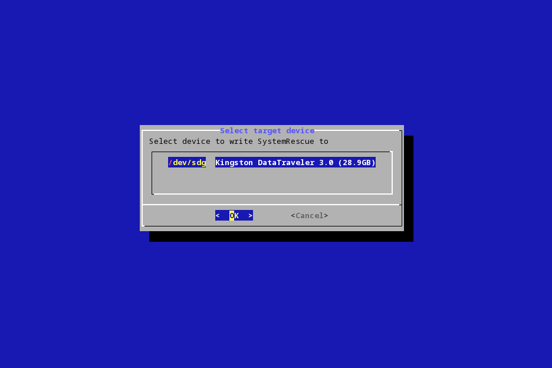
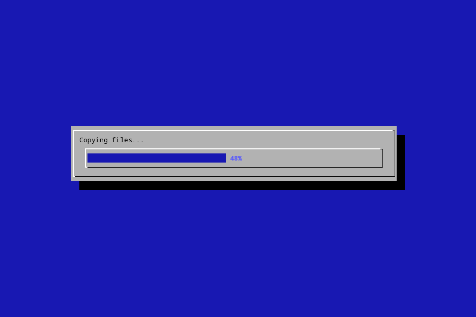

# SystemRescue USB writer

Tool to write [SystemRescue](https://system-rescue.org) to a USB memory stick.

It is packaged as AppImage so it can directly run on most Linux systems.

### Download AppImage

Get the latest release build from https://gitlab.com/gvegidy/systemrescue-usbwriter/-/releases/permalink/latest

### Running

- `chmod 755 sysrescueusbwriter-x86_64.AppImage`
- `./sysrescueusbwriter-x86_64.AppImage [OPTIONS] <ISO-FILE>`

### Options

```
-t|--targetdev=<DEVICE-PATH>   Device file of the USB media you want to write to.
                               Something like /dev/sdb.
                               A text UI to select a likely device is shown if missing.
                               
-i|--verify-only=<DEVICE-PATH> Don't write out the image, but just compare the current
                               content on the given device to the image.
                               Can't be used together with -t|--targetdev.

-e|--tmpdir=<TMPDIR>           Use the given directory for storing temporary files.
                               You need enough space there for unpacking the whole
                               iso image. Defaults to the TMPDIR environment variable.

-g|--grant=<TOOL>              <TOOL> being one of: sudo, pkexec, su
                               Use the given tool to grant permissions for accessing the
                               target device node. By default all 3 tools are tried.

-c|--cli                       Do not use the ncurses text UI, only command line

--appimage-extract             Unpack the AppImage. Overrides other parameters.

--appimage-mount               Mounts the AppImage to a path in TMPDIR, prints out the path.
                               Unmounts when terminated with Ctrl+C. Overrides other parameters.

-l|--licenses                  Show licenses of all programs packaged in the AppImage.
                               Use 'e' to view a file and 'q' to quit.
                               Showing the licenses overrides other parameters.

-h|--help                      Show this help. Overrides other parameters.

```

### Access rights

When running as non-root user, you usually need to gain write access to the target device.

sysrescueusbwriter checks if permissions are lacking and then tries `sudo`, `pkexec` and `su`
(in this order) to change the access rights. One of these programs has to be installed, be in $PATH and 
configured for automatic rights acquisition to work. 

Automatic rights acquisition works by chowning the file to the current user ($EUID). Since device
handles are usually created dynamically by udev, the handle owner is reset when the device is
disconnected or the system rebooted.

The alternative is that the user/admin grants access rights through alternative means before 
running sysrescueusbwriter.

### Requirements and Limitations

All AppImages need `libfuse.so.2`, `fusermount` and glibc to run. On some systems these are not installed by default
and might need to be installed manually:

| Distribution                  | Install command                                                                  |
| ----------------------------- |----------------------------------------------------------------------------------|
| Alpine Linux                  | `doas apk add gcompat fuse doas-sudo-shim; doas modprobe fuse` <sup>*)</sup>     |
| Arch Linux                    | `sudo pacman -S fuse2`                                                           |
| CentOS 7                      | `sudo yum install fuse-libs`                                                     |
| NixOS                         | `nix-env -iA nixos.appimage-run`                                                 |
|                               | Then run: `appimage-run sysrescueusbwriter-x86_64.AppImage ...`                   |
| Ubuntu 22.04 and newer        | `sudo apt install libfuse2`                                                      |

<sup>*)</sup> Requires the "community" repository to be enabled in `/etc/apk/repositories`

AppImage upstream is working on reducing these dependencies, see [#877](https://github.com/AppImage/AppImageKit/issues/877).

Viewing the embedded license files requires `less` to be in the $PATH.


### Screenshots

| [](./images/screenshot1.png) | [](./images/screenshot2.png) |

### Building

- Arch Linux on x86_64 required to build the AppImage
- Download `appimagetool-x86_64.AppImage` from https://github.com/AppImage/AppImageKit/releases
- call `build.sh`
- The build script will notify you of missing packages required for building

### Licensing

The SystemRescue USB writer scripts (and helper scripts) themselves are licensed `GPL-3.0-or-later`.

The AppImage contains separate programs and libraries that are licensed under their own licenses.
The license texts are contained in the AppImage below the path `./usr/share/licenses/`. To view the licenses
either call the AppImage with the `--licenses` parameter or unpack it.
